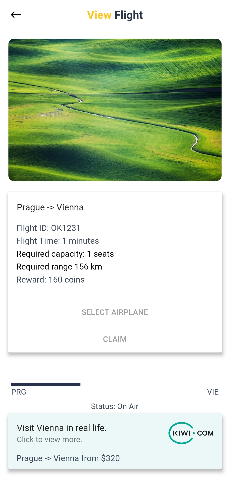

# Airline Manager

The most realistic Airline Manager mobile game. The game is running on Android & iOS. 

A project for Kiwi.com Mobile Challenge.

## General information

The Airline Manager is a singleplayer mobile game. You can manage your airline in real-time. My vision is to create a version, where players can compete and play together. You will be able to buy a slot at your favorite airport, manage board services and areas (economy, business, first-class).     

Top current features
* Realtime flight view
* Buy and sell airplanes
* Claim special flight offers
* Earn virtual coins
* See your stats

Business plan
* Virtual coins and gems - you can buy them with real-life money. With coins, you can buy and level-up your airplanes. Using gems you can speedup airplanes on the flight, buy super limited premium airplanes, or buy XP to level up. You can easily exchange gems for coins.
* In-app advertising - provide ad banner on the airplanes for real-life airlines. For example, you can buy an airplane SmartWings Airbus A330 in the game.
* Airplane skin - gold airplanes, custom paintings

Next steps
* June - major data update - using provider package & redesign UI, inventory update - see more information about your airplanes, publish beta version on Google Play
* July - flight offers update - realtime map, use Kiwi.com API for calculating the distance between airports, prepare to add XP level, add edit profile screen, publish version 1.0 on Google Play
* April - adding feature XP level, shop update - divide airplanes into categories, add new ones, publish beta version for iOS
* September - publish version 1.0 for iOS, divide flight offers into categories

### Screenshots
Check out a few screenshots from my app!





## Technical information

The application was developed using [Flutter](https://flutter.dev) SDK. Due to Flutter, you can run the application on the Android and iOS platforms. Backend is running on Google Cloud Functions - Firebase.

Kiwi.com API - Ad banner in Flight offer detail screen - try claimed flight offer in real life. Example: The user claims a flight from Prague to Amsterdam, then in detail, he'll see real-life offer to visit Amsterdam.

### Installation

You need to install [Flutter](https://flutter.dev/docs/get-started/install) and optionally an emulator.

### Usage

Run Airline Manager on emulator.
```dart
flutter run
```

Run Airline Manager on your mobile phone.
```dart
flutter run -d <your mobile phone>
```

## License

[CC BY-NC 4.0](https://docs.google.com/document/d/1wiSokF4ifgp1oCCoTu5mzmwKoTfZPqktBoTx1AqyhBg/edit?usp=sharing)